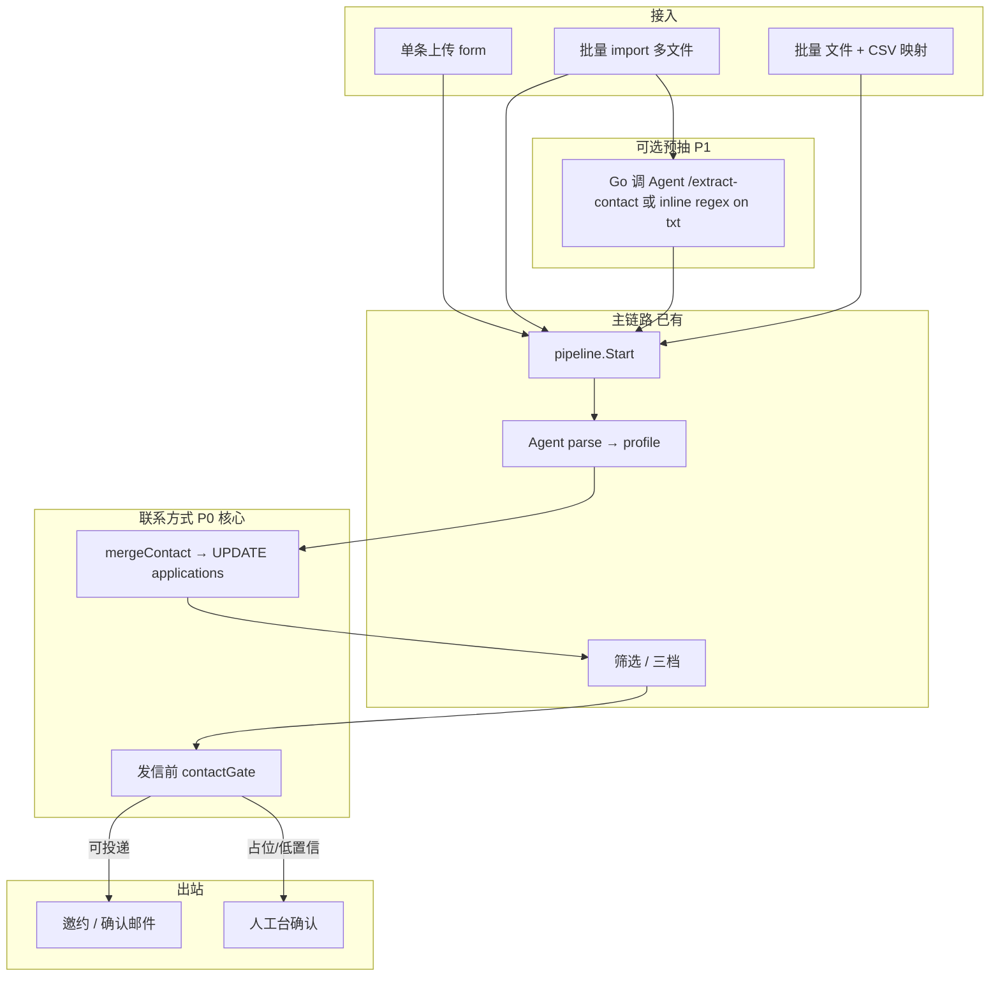

# 候选人联系方式解析方案（邮箱 / 姓名）

> **目标**：在单条上传、批量 import、解析/OCR 全路径上，形成与主流 ATS 一致的 **「多来源 → 校验 → 合并 → 发信前闸门」** 能力，避免占位邮箱误发邀约，又不在上传瞬间强依赖 HR 手填。  
> **基线代码**：Go `pipeline.Start` / `import.go`；Python `parse_docs.extract_text` + `parse_heuristics` / LLM `profile.email`。

---

## 1. 设计原则

| 原则 | 说明 |
|------|------|
| **文件即候选人实例** | 一个简历文件 → 一条 `applications`（+ 可选 `import_items`），主联系邮箱唯一 |
| **上传时可未知** | 允许占位邮箱先跑解析/筛选；**真实邀约前**必须解析为「可投递邮箱」或人工确认 |
| **解析优先于占位** | 简历正文/画像中的邮箱，在通过校验后应回填 `candidate_email` |
| **手填优先于解析** | HR 在表单明确填写的真实邮箱，不被 LLM 轻易覆盖（仅 HR 改单或审计后覆盖） |
| **可审计** | 邮箱来源、置信度、合并理由写入 `audit_events` 或专用字段 |
| **Fail-safe 发信** | 占位域、测试域、与 HR 同域等 → 禁止发真实 SMTP（或仅 dry-run） |

---

## 2. 术语与字段

### 2.1 应用层（`applications`）

| 字段 | 含义 |
|------|------|
| `candidate_email` | **当前生效**的联系邮箱（发邀约/确认函用） |
| `candidate_name` | 当前生效姓名（列表/邮件称呼） |
| `profile_json` | 解析画像（含 `email`、`name`、`parse_confidence` 等） |

**建议新增（迁移 `009_contact_provenance.sql`）**

```sql
ALTER TABLE applications
  ADD COLUMN contact_email_source ENUM(
    'hr_form','import_csv','import_placeholder','pre_extract','parse_profile','human_override'
  ) NULL AFTER candidate_email,
  ADD COLUMN contact_email_confidence DECIMAL(4,3) NULL,
  ADD COLUMN contact_resolved_at DATETIME NULL;
```

不强制一期就上列：可先只写 audit，二期再加列便于报表。

### 2.2 批量项（`import_items`）

| 字段 | 含义 |
|------|------|
| `candidate_email` | 创建申请时使用的邮箱（可能被后续回填更新，需在 item 上记录 `application_id` 关联查应用） |
| `resume_sha256` | 去重键（已有） |

**建议新增**

```sql
ALTER TABLE import_items
  ADD COLUMN email_source VARCHAR(32) NULL,
  ADD COLUMN pre_extract_email VARCHAR(255) NULL;
```

---

## 3. 邮箱来源与优先级（合并策略）

当多个来源同时存在时，**只升不降**（除非 HR 人工改或管理员策略 `force_parse`）：

```
优先级（高 → 低）：
  1. human_override     — 管理台人工改邮箱 / 人工通过前确认
  2. hr_form            — 单条创建表单非空 candidate_email
  3. import_csv         — 批量 CSV 列与文件绑定
  4. parse_profile      — LangGraph 解析后 profile.email（通过校验）
  5. pre_extract        — 仅 regex/轻量 extract_text 预抽（未走完整 parse）
  6. import_placeholder — import1@import.local 等
```

**合并规则（伪代码）**

```
function mergeContact(current, currentSource, candidate, candidateSource):
  if rank(candidateSource) > rank(currentSource):
    if validateEmail(candidate):
      return candidate, candidateSource
  if currentSource is placeholder and candidateSource is parse_profile:
    if validateEmail(candidate):
      return candidate, candidateSource
  return current, currentSource
```

**占位判定 `isPlaceholderEmail(email)`**

- 域名为 `import.local`，或本地部以 `import` + 数字开头且域为占位域
- 配置项 `CONTACT_PLACEHOLDER_DOMAINS=import.local,candidate@import.local`（可扩展）
- 空字符串视为占位

---

## 4. 校验规则（`validateEmail`）

业界常见最小集：

1. **格式**：RFC5322 简化 regex（与 `parse_heuristics` 一致即可）。
2. **长度**：local ≤ 64，总长 ≤ 254。
3. **黑名单域**：`example.com`, `test.com`, `localhost`, `import.local`（可配置 `CONTACT_BLOCKLIST_DOMAINS`）。
4. **可选：HR 域保护**：若 `email` 与登录 HR 或 `SMTP_FROM` 同域且非候选人名单 → 降置信或拒绝自动采用（防误把 HR 邮箱写进候选人）。
5. **多邮箱**：正文多个 `@` 时，Python 侧维护 `email_candidates[]`（可选二期）；默认取 **第一个通过校验** 或 **带「邮箱/Email/E-mail」标签行** 的匹配（启发式）。

**姓名 `validateName`**

- 非空、长度 2–40、不含 `@`、非纯数字；可与 profile.name 合并，规则同邮箱优先级。

---

## 5. 端到端流水线



### 5.1 单条上传

| 步骤 | 行为 |
|------|------|
| 创建 | `candidate_email` = 表单值；source = `hr_form` 或占位 |
| 解析后 | 若 source 为占位且 `profile.email` 校验通过 → 回填，source = `parse_profile` |
| 筛选通过 | `contactGate`：非占位才 `scheduleAndNotify`；否则 `needs_human` + `human_reason_code=contact_missing` |

### 5.2 批量 import（仅多文件）

| 步骤 | 行为 |
|------|------|
| 创建 item | 邮箱 = `importItemEmail`（占位序列）；source = `import_placeholder` |
| 可选预抽 | 对每文件 `pre_extract` 若成功且优于占位 → 创建时即用 pre_extract（P1） |
| 解析后 | 同单条，**以 profile 覆盖占位** |
| 发信 | 同 gate |

### 5.3 批量 import + CSV（P2，业界最稳）

**CSV 列**：`filename,email,name`（或 `sha256,email,name`）

| 步骤 | 行为 |
|------|------|
| 上传 | multipart：`jd_id` + `resumes[]` + `mapping.csv` |
| 匹配 | 按文件名（归一化）或 sha256 绑定；source = `import_csv` |
| 冲突 | CSV 邮箱与 parse 不一致 → 保留 CSV，audit 记 `contact_csv_parse_mismatch`；管理台 item 展示双值 |

---

## 6. Python Agent 职责

| 能力 | 位置 | 说明 |
|------|------|------|
| 正文抽取 | `tools/parse_docs.py` | pdf/docx/txt + OCR |
| 启发式邮箱 | `parse_heuristics.py` | 已有 regex |
| 结构化邮箱 | LLM profile | ReAct / structured output |
| **增强（P1）** | `agents/contact_extract.py` | 输入 `raw_text`，输出 `{ email, name, candidates[], confidence, method }` |
| **HTTP（P1）** | `POST /v1/extract-contact` | body: `{ resume_path \| resume_text }`，供 Go import 预抽（限流） |

**`email_candidates`（P2）**

- 正则找全部邮箱 → 过滤黑名单 → 按规则打分（标签行 +10、QQ/163 常见域 +1、靠近「手机」行 +2）→ 取 top1。

---

## 7. Go Pipeline 职责（P0 必做）

### 7.1 `applyProfileContact(ctx, appID, profile map, meta ContactMeta)`

在 `runIntelligentAndSchedule` 内，`RunParseScreen` 返回后、写 `profile_json` 的 **同一事务/步骤**：

1. 读当前 `candidate_email`, `candidate_name`, `contact_email_source`（若暂无列则仅 audit）。
2. `mergeContact` with `parse_profile`。
3. `UPDATE applications SET candidate_email=?, candidate_name=?, profile_json=?, contact_*`。
4. Audit：`contact_resolved_from_parse` detail: `{ before, after, email_in_profile }`。

### 7.2 `contactGate(ctx, appID) error`

在 **`scheduleAndNotify` 入口**（及 `humanApprove` 发信前）：

```go
if isPlaceholderEmail(email) {
  return markHumanWithCode(..., "contact_missing", "简历未解析出有效邮箱，请人工填写或重试解析")
}
if !validateEmailFormat(email) {
  return ...
}
return nil
```

配置：

- `CONTACT_REQUIRE_RESOLVED=true`（默认 true）：占位不允许自动发邀约。
- `CONTACT_ALLOW_PLACEHOLDER_IN_DRY_RUN=true`：与 `MAIL_DRY_RUN` 联调时可发向测试地址。

### 7.3 Import 创建时（P1）

- 调用 Agent `/v1/extract-contact` 或 Go 只读 `.txt` regex。
- 成功则 `CandidateEmail` = 预抽结果，source = `pre_extract`；失败仍占位。

### 7.4 去重（P2，与 V2 import 规划一致）

- 键：`jd_id + normalize_email(candidate_email)` 或 `jd_id + resume_sha256`。
- 策略 env：`IMPORT_DEDUP=skip|new_version|error`。
- skip：同键已有进行中/成功申请 → import_item `status=skipped`。

---

## 8. 管理台（Vue / 旧版）

| 场景 | UI |
|------|-----|
| 申请详情 | 展示 **生效邮箱** + 来源标签（表单/解析/占位/CSV）+ profile 内邮箱对比 |
| 批量 import | 说明：多文件默认占位 → 解析后自动回填；可选上传 CSV |
| 占位拦截 | 筛选通过但 gate 失败 → 状态 `needs_human`，原因「未解析出邮箱」 |
| 人工 | 编辑邮箱保存 → source = `human_override`，可再点「人工通过并约面」 |

---

## 9. 配置项（`.env.example`）

```bash
# 联系方式
CONTACT_REQUIRE_RESOLVED=true
CONTACT_PLACEHOLDER_DOMAINS=import.local
CONTACT_BLOCKLIST_DOMAINS=example.com,test.com,localhost
CONTACT_ALLOW_HR_DOMAIN_AS_CANDIDATE=false

# 批量
IMPORT_DEDUP=skip
IMPORT_PRE_EXTRACT=true

# 已有
MAIL_DRY_RUN=true
IMPORT_CONCURRENCY=2
```

---

## 10. 分期实施与验收

### Phase P0（1–2 天，必做）

- [x] Go：`isPlaceholderEmail` / `validateEmailFormat` / `applyProfileContact` / `contactGate`
- [x] 解析成功后占位 → profile 邮箱回填
- [x] 发邀约前 gate，占位 → `needs_human` + `contact_missing`
- [x] Audit 事件
- **验收**：批量 2 份带真实邮箱的 txt，占位创建，解析后列表邮箱正确；未解析出邮箱时不发 SMTP

### Phase P1（2–3 天）

- [x] Python `POST /v1/extract-contact` + import 预抽（`IMPORT_PRE_EXTRACT`）
- [x] DB 列 `contact_email_source` / `contact_resolved_at`（迁移 `009_contact_provenance.sql`）
- [x] 管理台展示来源标签（Vue `ApplicationDetailView`；`PUT .../contact` 人工改）

### Phase P2（3–5 天）

- [x] CSV 批量映射 API + Vue UI（`mapping_csv`：filename,email,name）
- [x] `IMPORT_DEDUP`（Go `import_dedup.go`；**`GET .../items` + `POST .../retry`**）
- [x] 多邮箱候选与 mismatch 审计（`pre_extract_meta` + `contact_email_mismatch` / `contact_csv_parse_mismatch`）

### Phase P3（可选）

- [x] zip 包解压导入（`archive`）；`external_id` 写入 import item 与 `applications`
- [x] 渠道对接 **`POST /v1/hooks/channel-applications`**（`X-Internal-Token`，Boss/ATS 通用 JSON）
- [x] 候选人确认页改邮箱（`action=update_contact`，来源 `candidate_self`）

---

## 11. 与现有 2.0 能力的关系

| 模块 | 关系 |
|------|------|
| 三档筛选 | 无邮箱不应 `auto_pass` 到发信；gate 在 screened 之后 |
| `error_kind=system` | 与 `contact_missing`（business）区分 |
| 双模型 parse verify | 提高 profile 一致性，间接提高邮箱质量 |
| LangGraph | 不改图结构，只在 Go 侧消费 `profile.email` |

---

## 12. 风险与对策

| 风险 | 对策 |
|------|------|
| LLM 幻觉邮箱 | 校验 + 与 pre_extract 不一致 → 降置信或人工 |
| OCR 错一位 | 低置信不发信；人工台重试 + 粘贴文本 |
| 同一邮箱多人 | 去重策略 + HR 人工拆分 |
| 隐私 | 日志/audit 脱敏；blocklist 测试域 |

---

## 13. 参考（业界）

- **ATS 通用**：Parser 产出 Canonical Candidate → Application 引用；批量靠 **文件 + 元数据表** 而非共用一个 HR 邮箱。
- **发信闸门**：Production 禁止向 placeholder / 内部域发信；Staging `MAIL_DRY_RUN`。
- **Greenhouse/Lever 类**：API 创建 application 可带 email，也可仅 attachment，由 parser 异步填充。

---

## 14. 渠道 / ATS 接入（P3）

**端点**：`POST /v1/hooks/channel-applications`  
**鉴权**：`X-Internal-Token: ${INTERNAL_API_TOKEN}`（或 Bearer 同 token）

**请求体示例**（Boss / 内推 / 邮件插件统一）：

```json
{
  "channel": "boss",
  "jd_id": "jd-uuid",
  "external_id": "boss-candidate-12345",
  "candidate_name": "张三",
  "candidate_email": "zhang@example.com",
  "resume_base64": "…",
  "resume_filename": "resume.pdf"
}
```

**行为**：`external_id + jd_id` 走 `IMPORT_DEDUP`；写入 `applications.channel` / `external_id`；流程与单条 `Start` 相同。重复投递返回已有 `application_id`（HTTP 202）。

**候选人改邮箱**：公开回复页 `POST /v1/public/reply/{token}`，`{"action":"update_contact","email":"…"}`，仅 `awaiting_reply`；来源 `candidate_self`。

---

*文档版本：2026-08；实施时更新 `V2-ROADMAP.md` §3.1 与 `PROJECT-STRUCTURE.md` 链接。*
