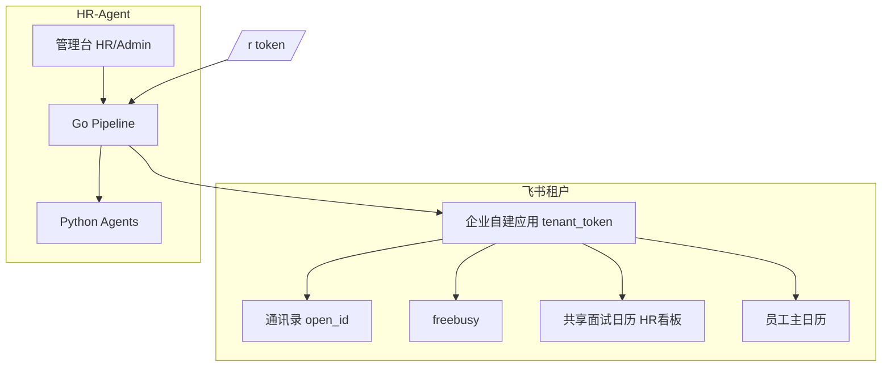

# HR-Agent 全招聘流程实施计划

> **文档目的**：在现有 MVP（单轮约面 + AI 解析/筛选 + 飞书日历 + 邮件选时）之上，设计为 **企业内真正可跑通的全招聘流程** 的分期路线。  
> **关联文档**：[V2-ROADMAP.md](./V2-ROADMAP.md)（2.0 工程化）、[CANDIDATE-CONTACT-SCHEME.md](./CANDIDATE-CONTACT-SCHEME.md)（联系方式）、[PROJECT-STRUCTURE.md](./PROJECT-STRUCTURE.md)（代码布局）。

---

## 1. 产品定位与原则

### 1.1 一句话

**HR-Agent = 招聘流程编排 + AI 决策辅助；飞书 = 组织身份、忙闲、面试看板与面试官日程。**

### 1.2 边界

| 在本系统 | 不在本系统（或仅状态/邮件） |
|----------|-----------------------------|
| 管理员 / HR 登录管理台 | 面试官登录（仅飞书日程参与人） |
| JD、申请、多轮状态、人工闸门 | 薪酬核算、编制 HC、HRIS 入职工单 |
| 解析 / 筛选 / 出题 Agent | 飞书日历 UI 的替代 |
| 候选人 `/r/{token}` 选时 | 候选人飞书账号（默认邮件） |

### 1.3 飞书集成原则（已定）

1. **一个企业自建应用**（`.env` 的 `FEISHU_APP_ID/SECRET`）：通讯录 + 日历 API；**可用范围 = 全部组织成员** + 管理员发布权限。
2. **`FEISHU_CALENDAR_ID` 共享日历** = **仅 HR 看的排期看板**（ACL 同步给 `staff_members.is_hr`）。
3. **面试官**：租户内 `open_id`，**不**订阅看板；确认后 **event attendees** → 各人 **主日历**。
4. **查 busy / 邀请**：针对 **本场参与人 open_id 列表**，与 HR-Agent 成员表、废弃的 `is_interviewer` 全局池脱钩。

### 1.4 角色

- **系统管理员**：成员、集成、审计、默认题库。
- **HR**：全流程操作、看飞书看板、面后推进轮次 / offer。
- **题库**：`can_manage_question_bank` 或管理员默认拥有。

---

## 2. 目标全流程（终态）

```text
[配置] JD（部门、要求、interview_plan 多轮：主题/时长/参与人规则）
        ↓
[入口] 单条 / 批量 import（external_id、联系邮箱闸门）
        ↓
[Agent] 解析 → 校验 → 筛选三档 → needs_human | rejected | 进入第 1 轮
        ↓
┌─ 每一轮 interview_round ─────────────────────────────────────┐
│  [Scheduling Agent] 按 JD 轮次 + 部门/特长/忙闲 智能选人 → P      │
│  [scheduling_verify] 规则 + 可选 LLM 校验（对齐 parse_verify）   │
│  → 飞书 freebusy(P) → 提议 2~3 时段 → 邮件 + /r/{token}        │
│  → 候选人选时 | 改期/都不合适 → needs_human（无回信 Agent）       │
│  → HR 前端：选手动时段 / 调 P / 再发本轮邀约                      │
│  → confirm → 共享日历建事件 + attendees(P) + VC                  │
│  → 本轮 interview_questions（Agent）                            │
│  → 面后 HR feedback → pass | fail | hold → 下一轮或 offer        │
└──────────────────────────────────────────────────────────────┘
        ↓
[Offer] offer_pending → sent → accepted | declined → hired（交接标记）
        ↓
[归档] 审计、留存策略、统计
```

**与 v1 差距**：v1 在「筛选通过 → **单轮** awaiting_reply → confirmed → 出题」即结束；无多轮、无面后、无 offer、参与人来自全局 `is_interviewer` 池。

---

## 3. 现状基线（已实现，保留）

| 模块 | 状态 |
|------|------|
| Go API + Vue 管理台 + 飞书 HR 登录 | ✅ |
| parse/screen Agent、三档、contact 闸门、批量 import | ✅（2.0 项多数已有） |
| 单轮 `interview_slots`、邮件邀约、公开页选时 | ✅ |
| confirm 后飞书 Hold + attendees、HR 日历 ACL | ✅（参与人仍绑旧池，待改） |
| confirm 后 generate_questions + RAG | ✅ |
| classify_reply（邮件辅路径）、人工台、审计 | ✅（**计划废弃** classify，改 HR 前端选时） |
| 成员 admin/HR、题库权限 | ✅ |

---

## 4. 目标架构（逻辑）



**Agent 分工（终态，已按产品决策更新）**

| Agent | 职责 | 不负责 |
|-------|------|--------|
| parse / verify / screen | 简历、岗位匹配 | 排期 |
| ~~classify_reply~~ | **移除** | — |
| **scheduling** | 按 JD 轮次需求 + 部门/特长/忙闲 **智能选人**；输出结构化指派 | 未校验的时间戳 |
| **scheduling_verify** | 与 parse_verify 同级：**规则 + 可选双路 LLM** 校验指派是否满足 JD（人数、角色、部门、特长） | 替代 freebusy |
| generate_questions | confirm 后出题 | 面后评分 |

**候选人改期/不合适**：仅 `/r/{token}` 结构化操作 → **`needs_human`**；**HR 在前端选手动时段** 再发邀约（无回信 Agent）。

**排期时刻**：飞书 freebusy + Go `propose_slots`；Scheduling Agent 只产出 **参与人 open_id 集合** 与 **建议窗口**，时刻须工具校验。

### 4.1 终态 Agent 清单（7 个逻辑单元，无回信 Agent）

| # | 名称 | 触发 | 输出 |
|---|------|------|------|
| 1 | **Parse（ReAct）** | 申请 pipeline | `CandidateProfile` |
| 2 | **Parse heuristics** | 解析后 | needs_human 规则 |
| 3 | **Parse verify** | 解析后 | 双路/LLM 校验 |
| 4 | **Screen + tier** | 校验通过后 | 分数、三档、reject/human |
| 5 | **Scheduling assign** | 每轮发邀约前 | `assigned_open_ids[]` + rationale |
| 6 | **Scheduling verify** | assign 后 | 与简历校验同级：规则硬校验 + 可选第二 LLM |
| 7 | **Generate questions** | 本轮 confirm 后 | `questions_json` |

（Contact 抽取当前以规则为主，可不计入 LangGraph Agent。）

**Scheduling assign 输入**：JD 该轮 `jd_round_interviewer_requirements`、JD 部门/要求文本、`interviewer_profiles`（部门、specialties）、池成员、飞书 freebusy。  
**Scheduling assign 输出**：按 `role_kind × headcount` 凑齐 open_id；panel 时所有人同一时段必须有空。  
**Scheduling verify 示例规则**：人数是否满足、部门是否匹配、`specialties` 是否覆盖、同一人是否重复指派、open_id 是否在租户内；可选 LLM 读 JD 与指派列表做一致性评分，不通过 → `needs_human`。

### 4.2 HR 人工选时（前端，替代回信 Agent）

| 场景 | 行为 |
|------|------|
| 候选 `/r` 改期次数用尽 / 点「都不合适」 | → `needs_human` |
| HR 人工台 / 申请详情 **排期** Tab | 查看本轮需求、当前 `assigned_open_ids`、飞书 busy 预览 |
| HR 操作 | 调整参与人；**手动录入或点选 1~3 个时段**（`interview_slots.source=hr_manual`）；**重发本轮邮件** |
| 候选人 | 仍只通过 **链接** 确认 HR 提供的时段（结构化 POST，无 LLM） |

---

## 5. 数据模型（结构化入库，推荐）

> **评估结论**：面试轮次、每轮主题、**每种面试官要几个** 属于 **稳定配置 + 要进前端表单/列表/外键**，适合 **关系表**；飞书同步字段、Agent 校验明细用 JSON 列补充。不建议整坨 `interview_plan_json` 作为唯一真相（可保留 `snapshot_json` 做审计快照）。

### 5.1 JD 面试轮次（配置）

**`jd_interview_rounds`**

| 列 | 说明 |
|----|------|
| `id` | PK |
| `jd_id` | FK → `job_descriptions` |
| `sort_order` | 第几轮（0…n-1），唯一 `(jd_id, sort_order)` |
| `round_key` | 稳定键，如 `hr_screen`, `tech_1` |
| `name` | 展示名：HR 初面 |
| `theme` | 面试主题/考察点（结构化文本） |
| `duration_minutes` | 时长 |
| `advance` | `hr_manual`：本轮 confirm 后须 HR 点 pass 才进下一轮 |

**`jd_round_interviewer_requirements`**（每轮要几种人、各要几个）

| 列 | 说明 |
|----|------|
| `id` | PK |
| `jd_round_id` | FK → `jd_interview_rounds` |
| `role_kind` | `hr` / `tech` / `hm` / `cross` / `custom` |
| `headcount` | **该角色需要几位面试官**（panel 则多人同时在线） |
| `pool_id` | 可选 FK → `interviewer_pools` |
| `match_jd_department` | 是否必须与 JD `department` 一致（从池/通讯录过滤） |
| `specialties` | JSON 数组，如 `["backend","go"]`，匹配 `interviewer_profiles` |
| `fixed_open_ids` | JSON，该角色指定人选（优先于池） |

前端 JD 编辑：**增删轮次** + 每轮 **表格行：角色 × 人数 × 池/部门/特长/固定人**。

### 5.2 面试官主数据（非登录用户）

**`interviewer_profiles`**（公司级，HR 维护或由飞书导入后补标签）

| 列 | 说明 |
|----|------|
| `open_id` | PK（飞书） |
| `name`, `email`, `department` | 缓存展示 |
| `specialties` | JSON 标签，供 Scheduling Agent 匹配 |
| `enabled` | 停用则不可被 Agent 选中 |

**`interviewer_pools` / `interviewer_pool_members`**

- 池：名称、`default_role_kind`、可选 `department` 约束  
- 成员：`pool_id` + `open_id`（可冗余 `role_kind`）

### 5.3 申请运行时

**`applications`**

- `current_round_index`（对应 `jd_interview_rounds.sort_order`）
- `offer_status`, `hired_at`（后期）

**`application_interview_rounds`**（每场每轮一条）

| 列 | 说明 |
|----|------|
| `id`, `application_id`, `jd_round_id` | 链到 JD 模板（JD 改后不 retroactive，可 snapshot） |
| `round_index`, `status` | pending / awaiting_reply / confirmed / … |
| `assigned_open_ids` | JSON，Scheduling Agent + verify 通过后的 **最终 P** |
| `assignment_detail` | JSON，Agent rationale、verify 结果（对标 `parse_verify_detail`） |
| `outcome`, `feedback_json`, `provider_event_id` | 面后 |

**`interview_slots`**（已有，扩展）

- `application_round_id` FK；`source`：`auto` | `hr_manual`（HR 在前端录入/选的时段）

**`application_round_hr_actions`**（可选审计）

- HR 手动改 P、手动 slot、重发邀约的操作者、时间

### 5.4 废弃

- `staff_members.is_interviewer`、全局 `RefreshInterviewerPool`
- **`classify_reply` Agent** 及 `/v1/pipeline/classify`、ingress 邮件意图路径（可保留 ingress 仅转 needs_human 提示「请使用链接」）
- 大块 `interview_plan_json` 作为唯一配置（若已有迁移草案可改为 **导入时写入关系表**）

---

## 6. 飞书管理员清单（上线前）

- [ ] 一个自建应用：日历 + 通讯录（应用身份读）权限 **已发布**。
- [ ] **可用范围 = 全部组织成员**。
- [ ] 创建/指定 **共享日历** `FEISHU_CALENDAR_ID`，HR 可订阅。
- [ ] `.env`：`CALENDAR_PROVIDER=feishu`，`FEISHU_USER_ID_TYPE=open_id`。
- [ ] 文档：HR 在飞书客户端 **订阅共享日历** 作为看板（管理台不做重日历 UI）。

---

## 7. 分期实施计划

### Phase 0 — 飞书与角色收口（1–2 周） ✅ 已落地（2026-08）

**目标**：产品与飞书模型一致，去掉「全局面试官池」误导。

| 项 | 交付 |
|----|------|
| 文档 | 本计划 + V2 §3.7 飞书原则（可合并引用） |
| 成员 UI | 仅 **管理员 + HR (+ 题库)**；隐藏/废弃「排期池」成员角色 |
| 排期代码 | `ListSlots` / `Hold` / `addAttendees` 接受 **per-request `AttendeeIDs`**；默认从 env **fallback** 直至 Phase 1 |
| HR ACL | 保持 `is_hr` → `EnsureCalendarACL` |
| 管理台 | 申请详情展示 `event_id`、飞书看板说明文案 |

**验收**：confirm 后事件在共享日历；面试官仅出现在个人日历；不再依赖 `is_interviewer` 才能 addAttendees。

---

### Phase 1 — 多轮 JD（关系表）+ 申请轮次（3–4 周） ✅ 骨架已落地（2026-08）

| 项 | 交付 |
|----|------|
| Migration | `011_interview_rounds.sql`：`jd_interview_rounds`, `jd_round_interviewer_requirements`, `application_interview_rounds`, `current_round_index` |
| Vue | **JD 面试计划页**：轮数、每轮主题/时长、**角色×人数×固定 open_id** |
| Go | `ResolveAttendees`（fixed_open_ids）+ `Constraints.AttendeeIDs`；`PUT .../interview-plan`；`POST .../rounds/{i}/advance` |
| Pipeline | 筛选通过 → round 0 → auto slots → awaiting_reply；无计划/无人 → needs_human |
| 申请详情 | 当前轮、`assigned_open_ids`、通过→下一轮 / 淘汰 / 暂缓 |

---

### Phase 2 — 面试官主数据 + HR 人工选时前端（2–3 周） ✅ 骨架已落地（2026-08）

| 项 | 交付 |
|----|------|
| Migration | `012_interviewer_profiles.sql`：`interviewer_profiles`（`role_kinds`/`specialties`/部门）、`interviewer_pools`、成员表 |
| Vue「面试官」 | 档案 CRUD（多角色分类）+ 面试池；侧栏入口（HR/Admin） |
| JD 需求 | 角色分类 × 人数 × 可选 `pool_id` / 特长 / 匹配 JD 部门 / 固定 open_id |
| Go 解析 | `ResolveAttendees`：fixed → pool → profiles（按 role_kind/特长/部门）；`POST .../manual-schedule` |
| **HR 人工选时 UI** | 申请详情：手工 1~3 slot、改指派、自动空档重发邀约 |
| 候选页 | `/r/{token}` 为主；**stub `HandleReply`**（邮件自由回复 → needs_human，引导用链接） |

**验收**：候选人点「都不合适」→ HR 在前端选手动时段并发送 → 候选人链接中选 HR 给的 slot。busy 预览仍属后续增强。

---

### Phase 3 — Scheduling Agent + scheduling_verify（2–3 周） ✅ 骨架已落地（2026-08）

| 项 | 交付 |
|----|------|
| Python | `POST /v1/scheduling/assign`：确定性凑齐 role×headcount（panel freebusy 交集）+ 可选 LLM 精选；内嵌 `scheduling_verify`（`rules` / `dual_llm`） |
| Go | `calendar.ListBusy`；`SCHEDULING_AGENT_ENABLED` 时 `prepareRoundScheduling` → Agent；失败写 `assignment_detail` → `needs_human`；成功再 `ListSlots` |
| 关闭 Agent | 仍走 Phase 2 `ResolveAttendeesForRound`（fixed → pool → profiles） |
| `.env` | 默认 `SCHEDULING_AGENT_ENABLED=true`；`SCHEDULING_LLM_REFINE=true`；`SCHEDULING_VERIFY_MODE=dual_llm`（规则 + 校验模型互验） |

**流程**：确定性规则凑齐 role×headcount → 可选 LLM 精选 → `scheduling_verify`（硬规则始终跑，dual_llm 再交叉打分）→ 失败 `needs_human`。

**验收**：JD 要求 tech×2 + hm×1，Agent 输出 3 人且 verify 通过；故意缺人 → needs_human。前端 busy 预览仍属后续增强。

---

### Phase 4 — 面后反馈 + Offer MVP ✅（2026-08）

| 项 | 交付 |
|----|------|
| 通讯录搜人 | `GET /v1/admin/feishu/users?q=`；面试官页「从飞书搜索」写入 `interviewer_profiles.open_id`（不落全量通讯录） |
| Migration | `013_offer_feedback.sql`：`offer_status` / `offer_note` / `offer_updated_at` / `hired_at` |
| 轮次反馈 | 轮次 `confirmed` 后 HR 代录 `feedback_json`（rating/summary/recommend），随 `AdvanceRound` 提交 |
| Offer 状态机 | `none → pending → sent → accepted\|declined → hired`；末轮 pass 自动 `pending`；`POST .../offer` |
| 前端 | 申请详情：轮次反馈表单 + Offer 区块；无电子签/邮件模板 |

**明确不做（本 MVP）**：管理台 busy 预览、面试官自填 scorecard、电子签/HRIS。

**验收**：末轮 pass → `offer_status=pending`；HR 可标记 sent/accepted/hired；通讯录搜人失败时提示开通并发布通讯录读权限。

---

## 8. 管理台信息架构（终态菜单）

侧栏按工作域分组；申请详情用 **Agent 进度轨**（一行看当前阶段）+ Tab（概览 / 面试 / Offer / 运行记录）。Agent 产出嵌在候选人详情中展示，不另开聊天页。

| 分组 | 菜单 | 用户 |
|------|------|------|
| — | Agent 工作台（原总览） | HR |
| 候选人 | 申请流水线 / 人工接管 / 投递上传 | HR |
| 岗位配置 | 岗位与面试计划 / 面试官档案 | HR / Admin |
| 系统 | 题库 RAG / 成员管理 | 按权限 |
| — | **无** 全量日历页 | 飞书共享日历看板 |

---

## 9. 测试与发布

| 阶段 | 测试 |
|------|------|
| 每 Phase 结束 | 扩展 `scripts/smoke-e2e.ps1`：多轮 + needs_human + confirm |
| Phase 1+ | 飞书集成测试账号：freebusy、attendees、ACL |
| 发布 | 迁移序号递增；README 状态机章节更新 |

---

## 10. 里程碑时间表（建议）

| 里程碑 | 内容 | 约计 |
|--------|------|------|
| M0 | Phase 0 飞书/角色收口 | +2 周 |
| M1 | Phase 1 多轮闭环 | +4 周 |
| M2 | Phase 2–3 通讯录/池/Agent | +4 周 |
| M3 | Phase 4–5 面后 + Offer | +5 周 |
| **可对外称「全招聘流程」** | M1+M2 最小；M3 完整 | ~15 周 |

并行人力建议：1 后端 Go + 0.5 前端 Vue + 0.5 Python Agent；飞书权限由管理员并行配置。

---

## 11. 明确不做（本计划范围外）

- 候选人飞书端小程序 / 租户内候选人账号。
- 替代飞书会议室审批流（仅 API 预定，审批失败 → needs_human）。
- 完整 HRIS 同步、电子签、背景调查供应商对接（仅留 webhook/状态钩子）。
- **邮件意图 classify Agent**（改期走 HR 前端）。
- 面试官在管理台填 scorecard（第一期 HR 代录即可）。

---

## 12. 下一步立即动作（本周）

1. 评审本计划，确认 **M1 前必须 Phase 0**（去 `is_interviewer` 产品语义）。
2. 飞书管理员完成 **§6 清单**。
3. 开 Phase 1 migration 分支：`011_interview_rounds.sql` 草案。
4. 在 `V2-ROADMAP.md` 顶部增加指向本文的链接（实施主计划）。

---

*文档版本：2026-08-18，对齐仓库 tag `v2.0.0`（Phase 0–4 MVP 已落地）。*
